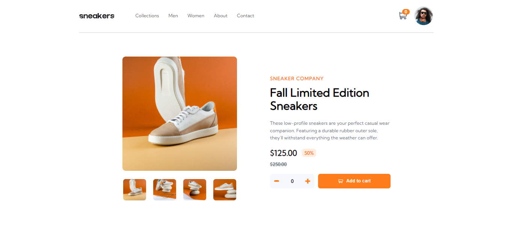

# Frontend Mentor - E-commerce product page solution

This is a solution to the [E-commerce product page challenge on Frontend Mentor](https://www.frontendmentor.io/challenges/ecommerce-product-page-UPsZ9MJp6). Frontend Mentor challenges help you improve your coding skills by building realistic projects.

## Table of contents

- [Overview](#overview)
  - [The challenge](#the-challenge)
  - [Screenshot](#screenshot)
  - [Links](#links)
- [My process](#my-process)
  - [Built with](#built-with)
  - [What I learned](#what-i-learned)
  - [Continued development](#continued-development)
  - [Useful resources](#useful-resources)


## Overview

### The challenge

Users should be able to:

- See hover states for all interactive elements on the page
- Switch the large product image by clicking on the small thumbnail images
- Add items to the cart
- View the cart and remove items from it


### Screenshot




### Links

- Solution URL: [Add solution URL here](https://your-solution-url.com)
- Live Site URL: [Add live site URL here](https://your-live-site-url.com)

## My process

### Built with

- Semantic HTML5 markup
- CSS custom properties
- Flexbox


### What I learned

I used this to change the color of the shopping cart (a svg in an img tag) from grey to white.
```css
.quantity-wrapper button img {
    filter: brightness(0) invert(1);
}
```
I was able to declare 90% of the values I used as css variables
```css
body {
  --orange: hsl(26, 100%, 55%);
  --pale-orange: hsl(25, 100%, 94%);
  --black: hsl(0, 0%, 0%);
  --light-black: hsl(0, 0%, 0%, 0.75);
  --very-dark-blue: hsl(220, 13%, 13%);
  --dark-grayish-blue: hsl(219, 9%, 45%);
  --grayish-blue: hsl(220, 14%, 75%);
  --light-grayish-blue: hsl(223, 64%, 98%);
  --transparent-black: rgba(0, 0, 0, 0.1);
  --white: hsl(0, 100%, 100%);
  --curvy-border: 0.5em;
  --circle: 50%;
  --small-font: 0.7em;
}
```
For the js, I was able to use the class constructor for the first time. I think it would be handy if I need to add another footwear brand to the mix.
```js
class Footwear {
    constructor(item, oldPrice, discount) {
        this._item = item
        this._oldPrice = oldPrice
        this._discount = discount
    }

    //getter
    get item() {
        return this._item
    }
    get oldPrice() {
        return `$${parseInt(this._oldPrice).toFixed(2)}`
    }
    get discount() {
        return `${parseFloat(this._discount).toFixed(2)}%`
    }
    get newPrice() {
        return `${parseInt(this._oldPrice * this._discount).toFixed(2)}`
    }
    //setter
    set item(updatedName) {
        this._item = updatedName
    }
    set oldPrice(updatedOldPrice) {
        this._oldPrice = `${parseInt(updatedOldPrice).toFixed(2)}`
    }
    set discount(updatedDiscount) {
        this._discount = `${parseFloat(updatedDiscount).toFixed(2)}`
    }
}
```

### Continued development
I would like to do more things with css. This project really challenged my understanding of how css works. Particularly the display attribute. I mostly used flex for this project

I need to understand responsiveness better. I think I need to work on making all my content resize responsively to different viewports.


### Useful resources

- [html resource 1](https://developer.mozilla.org/en-US/docs/Web/HTML/Global_attributes/tabindex) - This made it easier to apply the focus pseudoclass on the thumbnails of the gallery. I almost went mad trying to figure out why the focus selector was not working before I saw this (lol). I really liked this pattern and will use it going forward.

- [css resource 1](https://www.youtube.com/watch?v=H1-rmg1Fj3E) - This is an amazing video which helped me finally understand the difference between the active and focus pseudoclass. I'd recommend it to anyone still learning this concept.

- [css resource 2](https://www.youtube.com/watch?v=sjY2B_R4L1c) - This helped me change the shopping cart color from grey to white. I really liked this pattern and will use it going forward.
